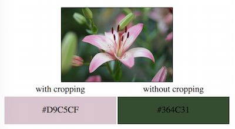
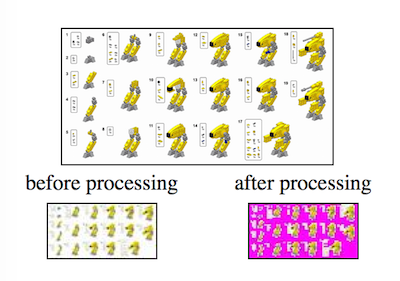

# prominentcolor

## Find the K most dominant colors in an image

The `Kmeans` function returns the K most dominant colors in the image, ordered in the order of dominance.

To execute it with the default values, call

`func Kmeans(orgimg image.Image) (centroids []ColorItem)`

which takes an image and returns the K dominant colors, sorted by the most frequent one first.

It uses Kmeans++ to pick K initial centroid values, and goes through all pixels to re-calculate the centroids used.

As default function `Kmeans` uses these settings:
* K=3
* crops the center of the image before resizing (removing 25% on all sides)
* resizes to 80 pixels
* uses Kmeans++
* uses median value to find the color for the centroid
* mask out white, black or green backgrounds

To have more control, call `KmeansWithArgs` or `KmeansWithAll`.
Below are the parameters that can be tweaked when calling those functions.

## K
As default it has got K=3.

If set to high, it will get too detailed and would separate nuances of the same color in different centroids.

## Resizing
As default it resizes the image to 80 pixels wide (and whatever height to preserve aspect ratio).

The higher value, the more time it will take to process since it goes through all pixels.

## Arguments

### `ArgumentSeedRandom` : Kmeans++ vs Random
As default it uses Kmeans++.

Kmeans++ will take K points that are as far away from each other as possible,
to avoid that the points might be too close to each other and really could be in the same cluster.
Hence the initial step takes slightly longer than just randomly picking the initial K starting points.

### `ArgumentAverageMean` : Median vs mean for picking color
As default it uses median.

When the colors are being lumped together in the K clusters, it can pick the _mean_ value, meaning
adding all values together and dividing by the number of colors in that cluster.
This will make the centroid color to be close to the color of the majority of the pixels in that cluster.
Median will take the median value, i.e. just take the one in the middle of all colors in the cluster.

### `ArgumentNoCropping` : Crop to center of image vs not cropping

As default, it crops the center of the image (removing 25% on all sides).

The theory being that the most relevant area in the image is in the middle,
so even if the most dominant color in that area is not the most dominant color in the whole image, it might be what the user percieve as most dominant.

The image below contains mostly green color, but since the flower is in the center of the image, we might be interested in perceiving that as the dominant color. When cropping (default) it finds pink to be most dominant, without cropping (by setting `ArgumentNoCropping`), green is most dominant.

### `ArgumentLAB` : RGB vs LAB

As default it uses RGB.

LAB is experimental atm, hence RGB is default.

### `ArgumentDebugImage` : Save temporary image

Saves an image in `/tmp/` where the pixels that have been masked out are colored pink.
Useful when modifying the values of the masks, so you can observe the result.

## Masking; removing background colours

`GetDefaultMasks` is the function containing the masks used as default, they can be used as a starting point
when passing other masks to the function. As default it filters white, black or green backgrounds.

To handle items that are shot against white/black/green background ("isolated" objects / clipart / green screen images),
the image is pre-processed to disregard the white/black/green background:
If the four corners are in that same color (or close to it), the code will take those as starting points for the areas to be removed.

In the image below, it removes much of the white (the pink pixels are the pixels that have been removed).
By removing those areas, "white" will have less of a chance of becoming the dominant color.

## Sample code

See
    [example/example.go](example/example.go)
and
    [example2/example2.go](example2/example2.go)
for sample calls with different parameters.

The sample images in
    [example/](example/)
comes from flickr and are all Public Domain https://creativecommons.org/publicdomain/zero/1.0/

The images used:
* https://www.flickr.com/photos/65720474@N03/8527042251/
* https://www.flickr.com/photos/isasza/26939476984/
* https://www.flickr.com/photos/janosvirag/27417460620/
* https://www.flickr.com/photos/janosvirag/28922730122/
* https://www.flickr.com/photos/mathiasappel/25535163354/
* https://www.flickr.com/photos/mathiasappel/28930160605/
* https://www.flickr.com/photos/pasukaru76/6833735316/
* https://www.flickr.com/photos/sloalan/28411051634/

## Author

Carl Asman (www.edlin.org)

## BSD License

See [LICENSE](LICENSE)
